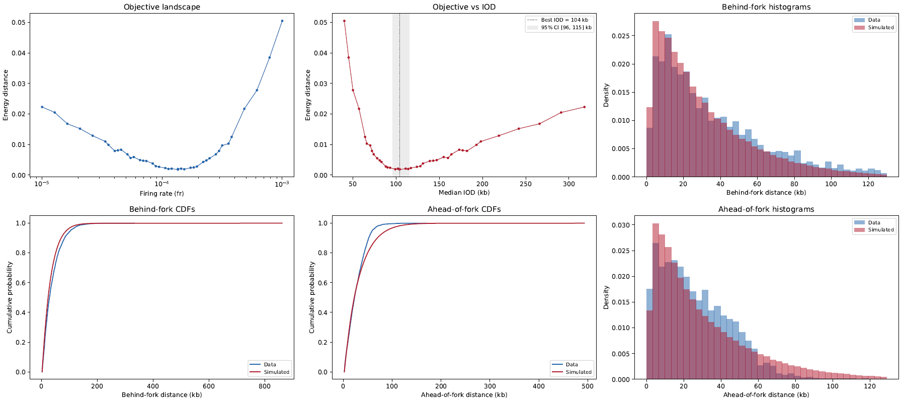

.. _meIODy:

meIODy
===============================

``DNAscent meIODy`` (pronounced "melody") is a ``DNAscent`` subprogram that estimates the inter-origin distance (IOD), or the typical spacing between fired replication origins, from nanopore sequencing data. It was named after the the Cambridge undergraduate, Olivia Mei, that developed it: meIODy is a portmanteau of Mei, IOD, and melody.

``DNAscent meIODy`` is intended for experimental setups in which EdU and BrdU are pulsed sequentially into replicating DNA. In this setting, replication forks produce contiguous tracks of analogue incorporation in Oxford Nanopore reads, as detected by ``DNAscent detect`` and annotated by ``DNAscent forkSense``. ``DNAscent meIODy`` extracts information of how fork tracks are positioned on each read, compares that information to an array of mathematical models of genome replication simulated at different IODs, and finds the best match to determine the median IOD for the sample. 

Usage
-----

.. code-block:: console

   To run DNAscent meIODy, do:
      DNAscent meIODy -l /path/to/leftForks_DNAscent_forkSense.bed \
                      -r /path/to/rightForks_DNAscent_forkSense.bed \
                      --origin /path/to/origins_DNAscent_forkSense.bed \
                      --termination /path/to/terminations_DNAscent_forkSense.bed \
                      -d /path/to/detectOutput.bam \
                      --tPulse1 5. \
                      --tPulse2 10. \
                      -o /path/to/output.IOD
   Required arguments are:
     -l,--left                 path to leftForks file from forkSense with `bed` extension,
     -r,--right                path to rightForks file from forkSense with `bed` extension,
        --origin               path to origins file from forkSense with `bed` extension,
        --termination          path to terminations file from forkSense with `bed` extension,
     -d,--detect               path to output from detect with `detect` or `bam` extension,
        --tPulse1              duration (in minutes) of the first analogue pulse,
        --tPulse2              duration (in minutes) of the second analogue pulse,
     -o,--output               path to output file for meIODy.
   Optional arguments are:
     -t,--threads              number of threads (default is 1 thread).

All four bed file inputs are produced by running ``DNAscent forkSense`` with the ``--markForks``, ``--markOrigins``, and ``--markTerminations`` flags. The pulse durations passed with ``--tPulse1`` and ``--tPulse2`` should be the duration (in minutes) of the first and second analogue pulses, respectively.

Method
------

``DNAscent meIODy`` uses the fork bed files and the detect output to infer the IOD in three stages.

**1. Fork speed estimation.** The mean fork speed is estimated from reads that contain exactly one fork call. To avoid biasing the speed estimate, reads are required not to contain an origin or termination call (identified from the ``--origin`` and ``--termination`` input files), and fork calls that are within 3 kb of a read end are excluded. This is similar to the methodology of `Jones, et al. 2025 <https://doi.org/10.1038/s41467-025-63168-w>`_. The track length of each retained fork call is divided by the total pulse duration (``--tPulse1`` + ``--tPulse2``) to give a speed in kb/min. The mean of these fork speeds is used in the ``DNAscent meIODy`` simulation.

**2. Extraction of single-fork flank distances.** For each read that carries exactly one fork call, ``DNAscent meIODy`` measures the distances in kb from each end of the fork track to the corresponding end of the sequenced read. For a rightward-moving fork where EdU was pulsed first and BrdU was pulsed second, the "behind" distance is the distance from the 5' end of the EdU segment to the 5' end of the read, and the "ahead" distance is the distance from the 3' end of the BrdU segment to the 3' end of the read. These are defined analogously for leftward-moving forks. The observed distribution of these flank lengths is the signal that is fitted by the simulation.

**3. Simulation-based IOD estimation.** ``DNAscent meIODy`` uses a Gillespie simulation of a stochastic `Beacon Calculus <https://doi.org/10.1371/journal.pcbi.1007651>`_ model of chromosome replication. In this model, every kilobase position on a simulated chromosome can either fire as an origin at rate *fr* (spawning two diverging replication forks) or be passively replicated by an incoming fork travelling at the estimated mean fork speed. The simulation is run for different values of *fr* over a coarse-to-fine grid. At each *fr*, single-fork flank distances are recorded in the same way as the observed data. The energy distance between the simulated and observed distributions of max(behind, ahead) serves as the objective function. The *fr* that minimises this objective is selected as the point estimate of IOD and bootstrapping constructs a 95% confidence interval on the median IOD.

Output
------

``DNAscent meIODy`` writes a single output file to the path specified with ``-o``. Like other ``DNAscent`` executables, the file begins with a short header:

.. code-block:: console

   #DetectFile /path/to/detectOutput.bam
   #ForkFiles /path/to/leftForks_DNAscent_forkSense.bed /path/to/rightForks_DNAscent_forkSense.bed
   #OriginFile /path/to/origins_DNAscent_forkSense.bed
   #TerminationFile /path/to/terminations_DNAscent_forkSense.bed
   #SystemStartTime 15/04/2026 10:32:11
   #Software /path/to/DNAscent
   #Version 4.1.1
   #Commit 4cf80a7b89bdf510a91b54572f8f94d3daf9b167
   #MeanForkSpeed 1.243
   #OptimalFiringRate 2.154321e-04
   #EnergyDistance 0.012345
   #MedianIOD 42.0
   #95ConfidenceInterval 35.0 51.0

The key summary statistics in the header are:

* ``MeanForkSpeed`` — the mean replication fork speed estimated from the data, in kb/min.
* ``OptimalFiringRate`` — the origin firing rate *fr* (in units of per-kb per-min) at which the simulation best matches the data.
* ``EnergyDistance`` — the normalised energy distance between the simulated and observed flank-length distributions at the optimal firing rate. Smaller values indicate a better fit.
* ``MedianIOD`` — the estimated median inter-origin distance in kb, corresponding to the optimal firing rate.
* ``95ConfidenceInterval`` — the lower and upper bounds of the 95% bootstrap confidence interval on the median IOD, in kb.

Below the header, the file contains five data sections, each introduced by a line beginning with ``>``:

.. code-block:: console

   >DataBehindDistances:
   12.4
   8.1
   ...
   >SimBehindDistances:
   11.9
   9.3
   ...
   >DataAheadDistances:
   15.2
   7.8
   ...
   >SimAheadDistances:
   14.8
   8.4
   ...
   >Landscape:
   1.000000e-05    312.0    0.1832
   2.154435e-05    218.0    0.1104
   ...

The ``DataBehindDistances`` and ``DataAheadDistances`` sections contain the observed behind and ahead flank distances (in kb) extracted from single-fork reads. The corresponding ``SimBehindDistances`` and ``SimAheadDistances`` sections contain the equivalent distances from the simulation run at the optimal firing rate; these can be compared to the observed distributions to visually assess the quality of fit. The ``Landscape`` section records the grid-search trajectory, with one row per evaluated firing rate. Each row contains three tab-separated columns:

* column 1 — the origin firing rate *fr*,
* column 2 — the median IOD (in kb) at that firing rate,
* column 3 — the normalised energy distance between the simulated and observed distributions at that firing rate.

The landscape section is useful for inspecting the shape of the objective function and verifying that the optimum is well-resolved.

Visualisation
-------------

We provide a python script ``DNAscent/utils/plotIOD.py`` for visualising the meIODy output file. It produces a figure like this:

The CDF and histogram plots compare the observed and simulated distributions of behind and ahead distances at the optimal firing rate. The objective plots show the energy distance across the grid search and the 95% confidence interval on the median IOD.

If your ``DNAscent meIODy`` output file is called ``iod.dnascent``, you can run the visualisation script like this:

.. code-block:: console

   python /path/to/DNAscent/utils/plotIOD.py iod.dnascent

Uncertainty and Model Assumptions
---------------------------------

In some situations, ``DNAscent meIODy`` may not be able to confidently estimate an IOD for your dataset. This will be evident from a very wide confidence interval on the median IOD. The most likely reason for this is a low number of fork calls (approximately 200-500 in total). In this situation, we recommend increasing the sequencing depth and/or using S-phase enrichment in future experiments to obtain more fork calls and a more precise estimate of the IOD.

While it is perfectly fine to use ``DNAscent meIODy`` to estimate changes in IOD in response to an inhibitor, the underlying mathematical model assumes that fork movement will be affected by that inhibitor for the entire duration of the analogue pulse. Adding the inhibitor during or at the start of the pulse will violate the model's assumptions and the resulting IOD estimate may be inaccurate.